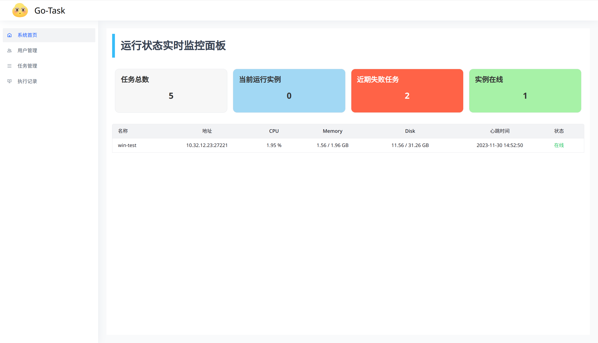
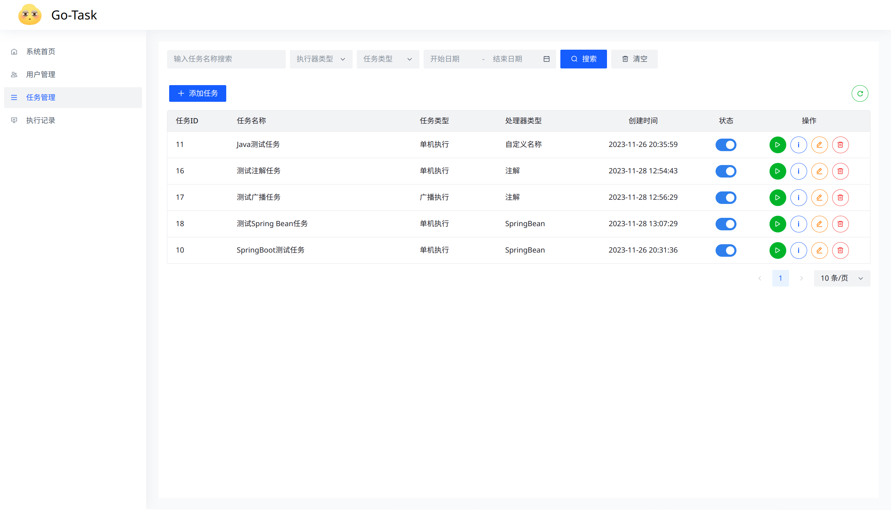
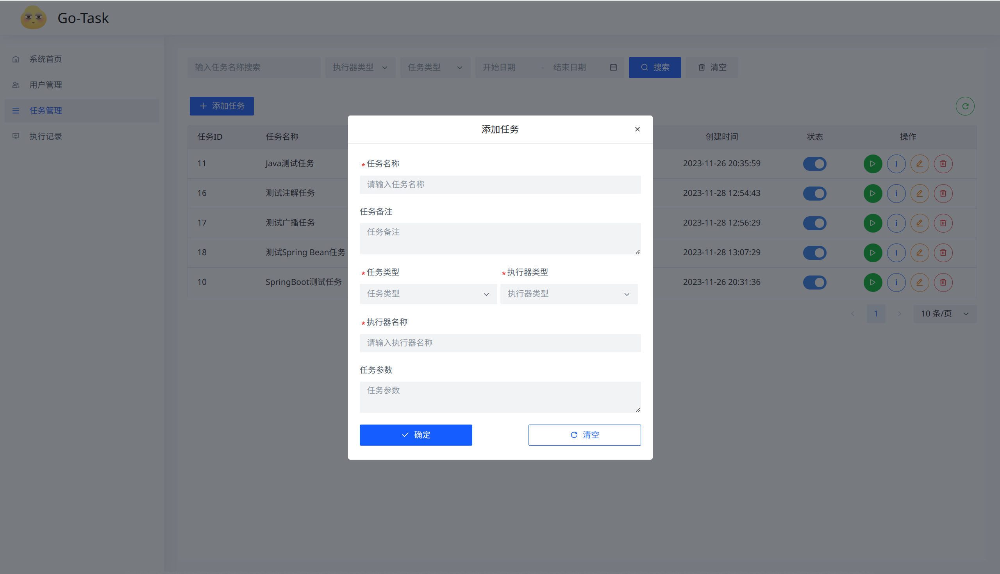
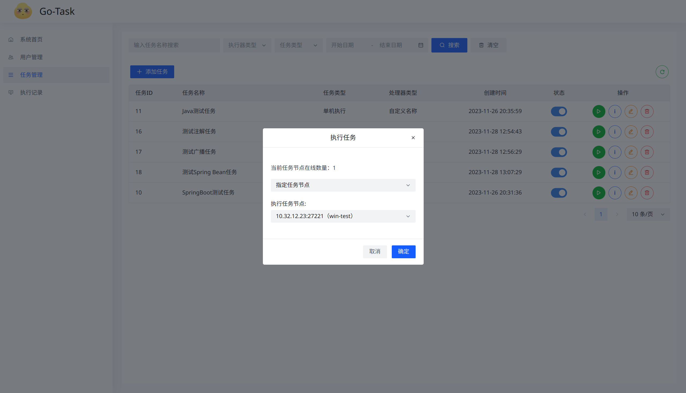
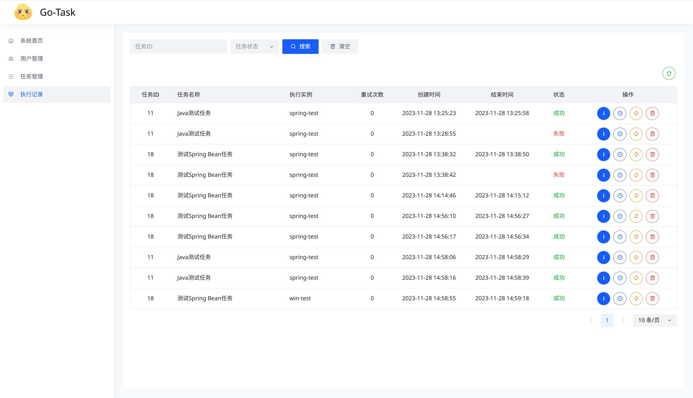
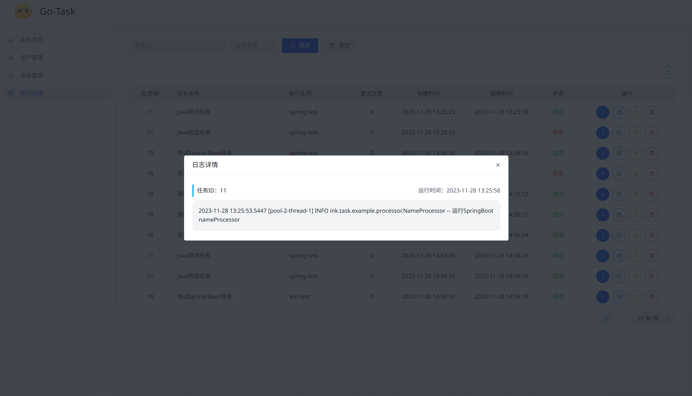

# Go-Task

一个使用`Go`做服务端的`Java`任务调度平台

## 简介

`Go-Task`是一个使用`Go`和`Postgrsql`的轻量级`Java`任务调度平台。支持**单机**、**广播**任务执行，多任务节点注册，任务节点信息上报、心跳检测。

1. 使用简单：提供前端可视化页面，可以便捷管理任务、运行记录和在线的执行节点
2. 多种执行模式：支持单机、广播两种模式运行
3. 多处理器支持：支持`SpringBean`、**注解**、**指定方法**等多种处理器类型
4. 日志可视化：任务处理器运行过程中的代码可以在前端页面查看

**待支持**

- 任务转移：任务在某个执行节点执行失败后顺延到下一节点执行
- 任务重试：从任务运行记录进行便捷重试
- 多执行策略：支持包括固定延迟、`CRON`等多种任务执行策略

## 部署

### 服务端

服务端后端技术栈为`Gofiber`和`xorm`，外部依赖仅`Postgresql`数据库。前端控制台为`Vue`项目，推荐打包后使用`nginx`运行（**`nginx`需要配置前端的请求转发，前端的统一请求路径可以在环境变量配置文件中配置**）。

#### Docker部署

使用项目内的`docker-compose.yml`文件直接运行即可，包含了所需的全部依赖，访问地址[http://localhost:3233](http://localhost:3233)，账户/密码：`admin/admin`

#### 手动部署

手动部署需要`clone`本项目，更改`go-task-server/internal/config.config.yaml`配置文件

```yaml
server:
  port: 5400 # 监听端口

database:
  host: 10.10.10.10 # 数据库地址
  port: 5432 # 数据库端口
  username: postgres # 用户名
  password: admin # 密码
  dbname: task_server # 数据库名称
```

然后编译运行即可（**数据库需提前安装并按照SQL文件创建对应的表结构**）

前端控制台是一个普通的`Vue`项目，使用了`bun`做依赖管理，`clone`后安装依赖并编译拿到页面静态文件挂载到`nginx`即可运行。由于后端没做跨域处理，`nginx`需要做前端请求转发，前端的统一请求路径可以在根目录下的环境配置文件进行配置。

### 任务节点

任务节点就是一个普通的基于`Netty`的`Java`项目，可以通过`Maven`导入或者直接引入`jar`包的方式使用，如果是`SpringBoot`项目，也可以使用提供的`go-task-spring-boot-starter`实现自动配置。

#### 普通Java项目

引入依赖

```xml
<dependency>
    <groupId>ink.go-task</groupId>
    <artifactId>go-task-java</artifactId>
    <version>1.0.0</version>
</dependency>
```

直接启动即可

```java
TaskNodeConfig config = new TaskNodeConfig.Builder()
    // 任务节点名称
    .nodeName("java-test")
    // 服务端地址
    .address("localhost:5400")
    // 信息上报时间间隔
    .intervals(10)
    .build();
TaskNodeBootstrap bootstrap = new TaskNodeBootstrap();
bootstrap.start(config);
```

#### SpringBoot项目

引入依赖

```xml
<dependency>
    <groupId>ink.go-task</groupId>
    <artifactId>go-task-spring-boot-starter</artifactId>
    <version>1.0.0</version>
</dependency>
```

修改配置文件，添加任务节点相关配置

```yaml
go-task:
  address: localhost:5400 # 服务端地址
  node-name: spring-test # 节点名称
  intervals: 10 # 上报时间间隔
```

修改启动类，添加注解即可完成配置

```java
@SpringBootApplication
@EnableGoTask
public class ExampleApplication {
    public static void main(String[] args) {
        SpringApplication.run(ExampleApplication.class, args);
    }
}
```

## 快速使用

### 前端控制台

首页会实时显示当前在线的执行节点信息和任务处理的数量，如果任务节点三次心跳超时的话会被设为**离线**状态，此时无法下发任务到该节点。




任务管理页面就是对任务的增删改查，**单机执行**的任务会通过轮询算法下发到不同的任务节点执行，**广播执行**的任务会下发到状态为在线的每一个节点。如果是**单机执行**的任务，在点击执行按钮后可以选择指定节点运行。任务的运行参数会原值下发给执行此任务的节点。

任务的执行器类型需要根据执行节点来确定，基于`spring-boot-starter`的执行节点可以处理所有执行器类型，而基于普通`Java`项目的执行节点仅可以处理**自定义名称**和**注解**两种类型。



添加任务



修改任务


运行任务




运行记录页面可以进行查询任务的运行结果、查看的任务运行日志和重试任务（待实现）等操作。任务运行记录的日志可以有多条，如果对运行记录进行重试操作的话，就会在当前日志的基础上，继续新增日志记录。广播执行的任务会有多条运行记录（以执行节点区分）。



查看运行日志



### 编写任务处理器

任务处理器接口有两种类型：

- `SingleProcessor`：单机任务
- `ClusterProcessor`：广播任务

使用**自定义注解**为执行器名称的单机任务处理器

```java
// 实现单机任务处理器接口
public class AnnotationProcessor implements SingleProcessor {

    @Override
    // 使用注解声明处理器名称
    @GoTask("annotationProcessor")
    public TaskResult processor(GoTaskContext context) throws Exception {
        Logger logger = context.logger();
        logger.info("运行annotationProcessor");
        String value = context.params();
        TaskParams params = JsonUtils.form(value, TaskParams.class);
        if (params == null) {
            throw new NullPointerException("任务运行参数不能为空");
        }
        Thread.sleep(5000);
        logger.info("运行参数：{}", params);
        return new TaskResult(true, "success");
    }
    record TaskParams(Integer id, String name) {}
}
```

使用**方法返回值**为处理器名称的广播任务处理器

```java
// 实现广播任务处理器接口
public class FuncNameProcessor implements ClusterProcessor {
    @Override
    public TaskResult processor(GoTaskContext context) throws Exception {
        // 获取日志对象
        Logger logger = context.logger();
        // 获取任务参数
        String params = context.params();
        logger.info("运行nameProcessor");
        Thread.sleep(5000);
        return new TaskResult(true, "success");
    }

    /**
     * 使用方法的返回值作为任务处理器名称
     * @return 返回任务处理器名称
     */
    @Override
    public String singleProcessorName() {
        return "nameProcessor";
    }
}
```

基于`spring-boot-starter`的`Bean`任务处理器。**在使用了spring-boot-starter的情况下，所有任务处理器都需要被Spring 的 IOC 管理**

```java
// Component注解中直接声明任务处理器名称即可
@Component("springProcessor")
public class BeanProcessor implements SingleProcessor {
    @Override
    public TaskResult processor(GoTaskContext context) throws Exception {
        Logger logger = context.logger();
        logger.info("运行 springProcessor");
        Thread.sleep(5000);
        return new TaskResult(true, "success");
    }
}
```

